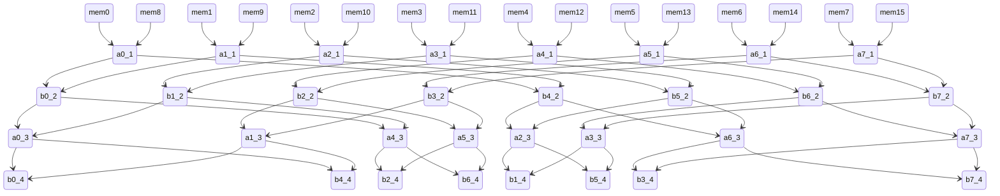

```mermaid
stateDiagram
    # memory2register
    mem0 --> a0_1
    mem8 --> a0_1
    mem1 --> a1_1
    mem9 --> a1_1
    mem2 --> a2_1
    mem10 --> a2_1
    mem3 --> a3_1
    mem11 --> a3_1
    mem4 --> a4_1
    mem12 --> a4_1
    mem5 --> a5_1
    mem13 --> a5_1
    mem6 --> a6_1
    mem14 --> a6_1
    mem7 --> a7_1
    mem15 --> a7_1

    # unpacklo_epi8
    a0_1 --> b0_2
    a1_1 --> b0_2
    a2_1 --> b1_2
    a3_1 --> b1_2
    a4_1 --> b2_2
    a5_1 --> b2_2
    a6_1 --> b3_2
    a7_1 --> b3_2

    # unpackhi_epi8
    a0_1 --> b4_2
    a1_1 --> b4_2
    a2_1 --> b5_2
    a3_1 --> b5_2
    a4_1 --> b6_2
    a5_1 --> b6_2
    a6_1 --> b7_2
    a7_1 --> b7_2

    # unpacklo_epi16
    b0_2 --> a0_3
    b1_2 --> a0_3
    b2_2 --> a1_3
    b3_2 --> a1_3
    b4_2 --> a2_3
    b5_2 --> a2_3
    b6_2 --> a3_3
    b7_2 --> a3_3

    #unpackhi_epi16
    b0_2 --> a4_3
    b1_2 --> a4_3
    b2_2 --> a5_3
    b3_2 --> a5_3
    b4_2 --> a6_3
    b5_2 --> a6_3
    b6_2 --> a7_3
    b7_2 --> a7_3

    # unpacklo_epi32
    a0_3 --> b0_4
    a1_3 --> b0_4
    a2_3 --> b1_4
    a3_3 --> b1_4
    a4_3 --> b2_4
    a5_3 --> b2_4
    a6_3 --> b3_4
    a7_3 --> b3_4

    # unpackhi_epi32
    a0_3 --> b4_4
    a1_3 --> b4_4
    a2_3 --> b5_4
    a3_3 --> b5_4
    a4_3 --> b6_4
    a5_3 --> b6_4
    a6_3 --> b7_4
    a7_3 --> b7_4
```
